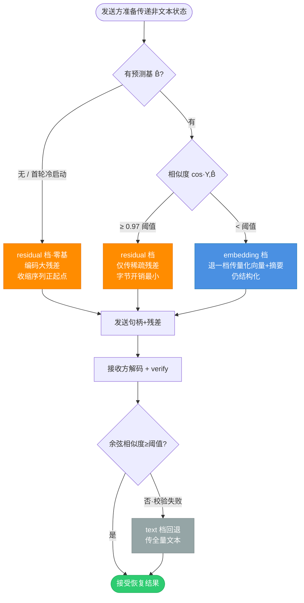
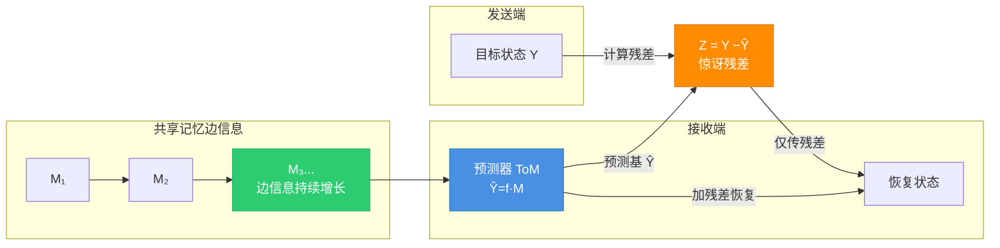
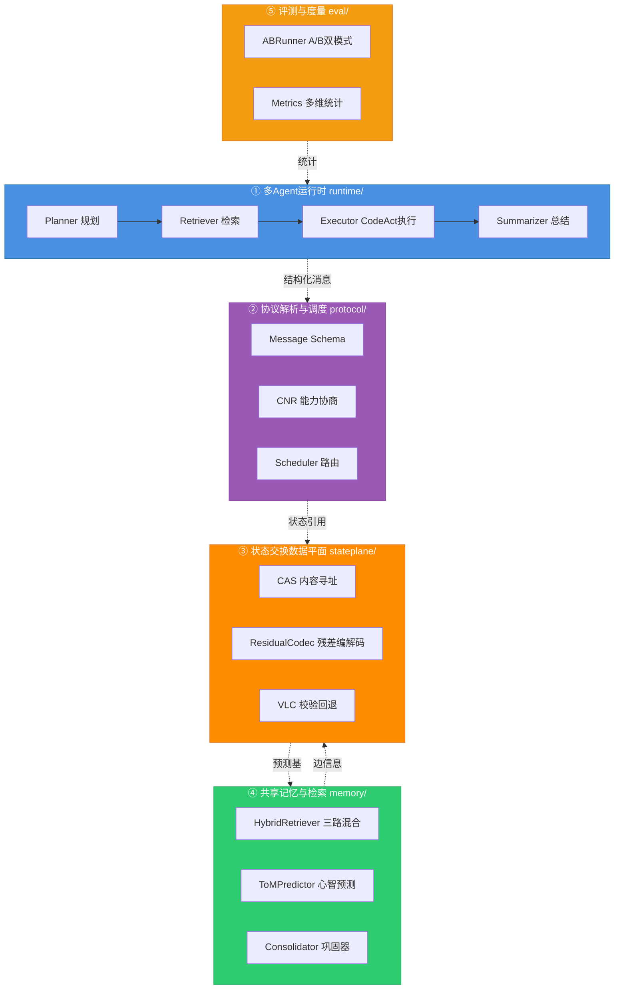
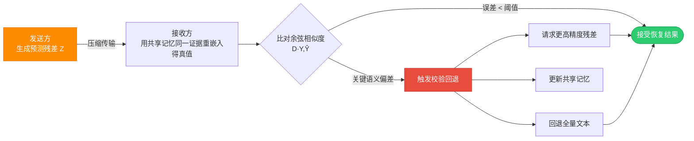

# SYNAPSE 说明书 · Mermaid 流程图源码

> 用途：供项目说明书嵌入。GitHub / Typora / VSCode 预览可直接渲染；转 docx 需用 `mermaid-cli` 或 pandoc 的 mermaid 插件预先生成 PNG。
> 生成 PNG 命令（可选）：`mmdc -i 某图.mmd -o 某图.png -b transparent -w 1200`

---

## 图M1 · 核心正反馈闭环（Memory↗→Predict↑→Residual↓→Comm↓）


---

## 图M2 · 三档混合协议（发送方主动预判选档）



---

## 图M3 · Wyner-Ziv 编码示意（带增长边信息）



> 可达速率下界：**R = H(Y | B̂ⱼ) = H(Y|Bⱼ) + Δ**，其中 Δ = I(Y;Bⱼ|B̂ⱼ) ≥ 0 为 ToM 失配惩罚；当预测准确（B̂ⱼ→Bⱼ）时 Δ→0，速率趋于 Wyner-Ziv 信息地板。

---

## 图M4 · 五模块系统架构（数据流 ↓ 记忆反哺 ↑）



---

## 图M5 · Verified Lossy Coordination 流程



> 静默损坏率：**0**（有校验）vs **16/16 全错**（无校验基线）。

---

## 使用说明

- 上述 mermaid 代码块可直接粘贴到支持 mermaid 的 md 编辑器（Typora/VSCode/Obsidian）渲染。
- 若需转 docx，推荐用 mermaid-cli 预渲染：
  ```bash
  npm install -g @mermaid-js/mermaid-cli
  mmdc -i mermaid_diagrams.md -o mermaid_render.html   # 或逐图导出 PNG
  ```
- 也可在 Word 中插入对象，或截图后作为图片粘贴。
