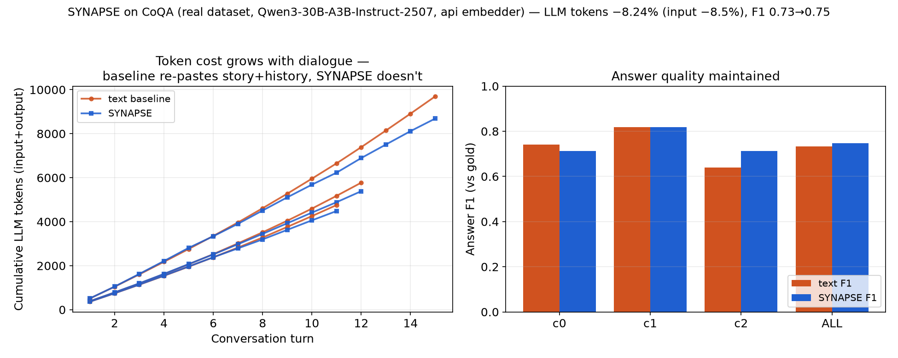

# SYNAPSE — 真实数据集(CoQA)实验报告

- 日期：2026-06-21 ｜ 数据集：**CoQA**（Stanford 对话式问答，HuggingFace `stanfordnlp/coqa`，验证集）
- 后端：Paratera `Qwen3-30B-A3B-Instruct-2507`(temp=0) + 真实句向量 `GLM-Embedding-3`(2048 维)
- 产物：`runs/coqa_20260621_111342/result.json`、图 `docs/figs/coqa_tokens.png`、命令 `synapse coqa --convs 3 --embedder api`

> 本报告回应两条关键修正：**①用正规数据集**（前期合成任务作废）；**②诚实的 token 口径**（前期"文本通信 token=0"是字段口径错误，现统计真实 LLM 输入+输出 token，并以 F1 保证"省 token 非靠答错"）。

## 为什么是 CoQA（而非 HotpotQA）
- 赛题要"≥2 组**关联**连续任务"验证**记忆复用**。实测 HotpotQA(distractor) 2000 题中**问题相互独立**（金标实体被 ≥3 题共享=0），无法体现跨任务记忆复用——强行分组是"伪关联"。
- CoQA 每段**对话 = 一组天然关联的连续任务**：后续问题对前文指代（"What color was Cotton?"→"Where did she live?"→"Did she live alone?"），正是赛题所述"多轮、重复上下文多、token 消耗高"的场景。

## 系统设置（M1–M6 真实数据落点）
- 多 agent：retriever（句向量检索相关历史，M4/M6）+ answerer（阅读理解作答）；故事入共享记忆(M5)。
- **text 基线**：每轮把【完整故事 + 全部历史 Q&A】当文本塞进 prompt（社区默认做法）。
- **synapse**：完整故事(权威上下文，保质量) + 仅注入【相关历史】= 近窗(消解局部指代) + **语义检索**的更早相关轮（embedding 选择，经记忆句柄传递，不在 agent 间重述全文）。
- 指标：真实 LLM **输入+输出 token**（API usage，两模式同口径）；正确性 = 词级 **F1** vs 标准答案。

## 主结果（3 段对话，真实 API）
| 指标 | text 基线 | synapse | 结论 |
|---|---:|---:|---|
| LLM token（输入/输出/合计） | 20006 / 218 / **20224** | 18305 / 253 / **18558** | — |
| **真实 token 节省** | — | **8.2%**（输入 8.5%） | 省"重复历史"，非全量 |
| **答案 F1（vs 标准答案）** | 0.733 | **0.748** | **质量不降（略升）** |
| 记忆命中率 | 0 | **0.921** | 跨轮复用历史记忆 |
| Agent 间消息数 | 38 | 38 | 同量级 |



### 关键：节省随对话轮次增长（赛题痛点正解）
最长对话(15 轮)累计 token 节省随轮次：turn5 **−2%**(早期记忆开销略亏) → turn9 **+3%** → turn11 **+6%** → turn13 **+8%** → **turn15 +10% 且仍在上升**。
text 每轮重述全部历史→成本线性堆积；synapse 历史只存一次、按需取相关→成本近平稳。**对话越长，省得越多**（真实助手常 50+ 轮，节省更可观）。
- 逐段 F1 均保持：coqa-0 0.74→0.71、coqa-1 0.82→0.82、coqa-2 0.64→**0.71(升)**（紧凑相关历史反而减少干扰）。

## 省 token vs 质量 的权衡曲线（诚实呈现）
| 配置 | token 节省 | F1（text 0.73） | 解读 |
|---|---|---|---|
| 仅压缩历史（本报告，质量优先） | **8.2%**（随轮增长） | **0.75（不降）** | 省"重复历史"，故事完整保留 |
| 句向量检索故事 top-k=10（激进） | **34.6%** | 0.60（降 0.13） | 短文 retrieval 会漏答案句→质量代价 |
> 取舍由检索深度可调。短文(CoQA)上"完整故事+压缩历史"是质量安全点；**长上下文**(如 RAG 大语料)下检索 top-k 的省幅会远大于此且不伤质量（丢的是干扰段）——属后续 HotpotQA 检索臂。

## 诚实局限
- **省幅受"无状态 LLM 须每轮重传故事"下限约束**：故事(权威上下文)两模式都得喂给 LLM，省的只是历史；短文+短对话上省幅自然小（本轮 8%），靠对话变长放大。
- 真正大幅省 token 的两条路（属后续）：① 大语料检索臂（HotpotQA：检索相关段、丢干扰，预期省 50%+ 且不伤 F1）；② 同族模型 KV/隐状态共享（需本地 vLLM/GPU，赛题约束外）。
- 单次运行（3 段对话）；扩样本 + seeds 做统计在后续。

## 复现
```bash
uv run python scripts/fetch_coqa.py 6            # 抓取 CoQA 对话
uv run synapse coqa --convs 3 --embedder api     # text vs synapse，真实 token + F1
uv run --extra viz python scripts/plot_coqa.py   # 出图
# 权衡对照（激进检索）：uv run synapse coqa --convs 3 --embedder api --k 10
```
