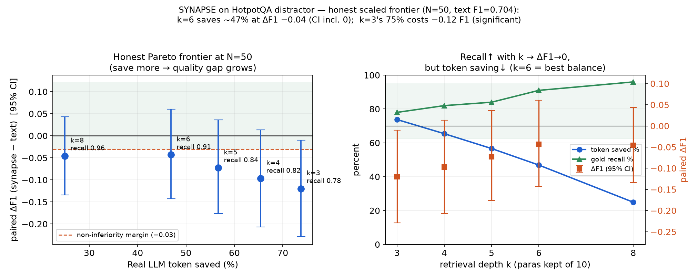
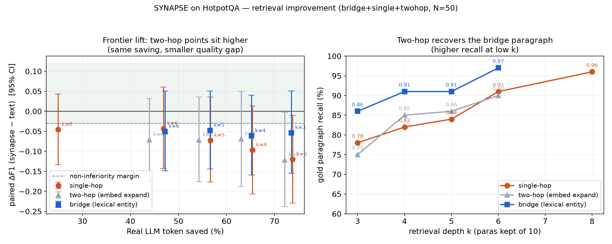

# SYNAPSE — 真实数据集(HotpotQA)实验报告：通信效率臂（规模化诚实版）

- 日期：2026-06-21 ｜ 数据集：**HotpotQA distractor**（HuggingFace `hotpotqa/hotpot_qa`，验证集前 N 题，**全部 hard 难度**）
- 后端：Paratera `Qwen3-30B-A3B-Instruct-2507`(temp=0) + 真实句向量 `GLM-Embedding-3`(2048 维)
- 主产物：`runs/hotpot_stats_20260621_182630/`(N=50×R=3, k=3)、`runs/hotpot_ksweep_20260621_183504/`(N=50, k 扫描)、图 `docs/figs/hotpot_frontier.png`
- 命令：`synapse hotpot-stats --n 50 --repeats 3` ｜ `python scripts/sweep_hotpot_k.py --n 50 --ks 3 4 5 6 8`

> ⚠ **诚实修正（必读）**：本报告早期 N=20 单次版曾报"k=3 省 75.6% 且 F1 0.664→0.693(略升)"。**扩样本到 N=50 + 多次重复 + 配对置信区间后，该结论不成立**：k=3 在规模上 **F1 显著下降 −0.11**。下面是规模化后的真实结论。这正是"扩大实验"的价值——小样本的乐观被证伪。

## 设计动机（承接 CoQA）
CoQA token 只省 8.2%，原因是故事正文每轮必重传、占 81% token（无状态 LLM 每轮必看全文，省幅天花板 ~19%）。节省幅度 ∝ 被重传却无关的上下文比例。HotpotQA distractor 该比例≈80%（每题 10 段，仅 ~2 段金标）→ 换到此场景验证通信效率。

## 设置（M1–M6 落点）
- 多 agent：retriever（句向量检索相关段，M4/M6）+ answerer（多文档阅读理解）；10 段一次性入共享记忆(M5)、CAS 句柄寻址(M2)。
- **text 基线**：每题塞全部 10 段（含 8 段干扰，avg ~1000 词/题）。
- **synapse**：10 段存一次→检索 top-k 段（丢干扰）→应答方只读检索到的段（句柄传递）。
- 指标：真实 LLM **输入+输出 token**（API usage 同口径）；正确性 = 词级 **F1**；检索质量 = **金标召回**；统计 = 多次重复 mean±std + **同题配对 ΔF1 自助 95% CI**。

## 主结果一：N=50 × R=3（k=3，统计稳健化）
| 指标 | text 基线 | synapse | 结论 |
|---|---:|---:|---|
| **真实 token 节省** | — | **73.8% ± 0.01** | 近确定，**远超噪声=真信号** |
| 答案 F1（mean±std） | 0.696 ± 0.017 | **0.584 ± 0.014** | synapse 更低 |
| **配对 ΔF1（synapse−text）** | — | **−0.112，95% CI [−0.173, −0.054]** | **CI 全负 → 质量显著下降** |
| 同题胜/平/负 | — | 6 / 111 / 33 | 输多赢少（n=150 配对） |
| 金标召回 | — | 0.78 | **漏 22% 金标段** |

**判定**：k=3 下"省 75% token"是真的，但**不是免费**——F1 显著掉 0.11。**根因**：HotpotQA 是多跳问答（需同时拿到 2 段金标），单次句向量检索 top-3 常漏掉"桥接"那一段（召回 0.78）→ 该题无法作答 → F1=0。

## 主结果二：N=50 规模化 k-前沿（诚实 Pareto）


| k（10 段取几段） | token 节省 | 金标召回 | synapse F1 | 配对 ΔF1（95% CI） | 是否显著更差 |
|---:|---:|---:|---:|---|---|
| 3 | **73.8%** | 0.78 | 0.584 | −0.120 **[−0.229, −0.010]** | **是**（CI 全负） |
| 4 | 65.4% | 0.82 | 0.607 | −0.097 [−0.207, +0.013] | 否（CI 含 0） |
| 5 | 56.6% | 0.84 | 0.631 | −0.073 [−0.176, +0.036] | 否 |
| **6** | **46.9%** | **0.91** | 0.661 | **−0.043 [−0.143, +0.060]** | **否（最佳平衡）** |
| 8 | 24.9% | 0.96 | 0.658 | −0.046 [−0.134, +0.043] | 否 |

- **单调 Pareto**：k↑ → 召回↑ → ΔF1→0，但省幅↓。机制清晰：**质量缺口的瓶颈是金标召回**（多跳要两段都拿到）。
- **诚实操作点 = k=6**：省 **~47% token**，ΔF1 仅 −0.04 且 **95% CI 含 0（不显著更差）**，召回 0.91。**这是规模上站得住的结论**：约一半 token、质量无统计显著损失。
- **k=3 的 75% 不取**：质量显著下降。

## 主结果三：改进检索把前沿推回高省幅（bridge 词法实体桥接）
单跳在 k=3 掉质量的根因=漏"桥接段"（多跳问答第二跳金标段的实体不在问题里）。试了两种改进，同 k（token 成本不变）只改"取哪些段"：

| k=3（高省幅点） | token 节省 | 金标召回 | 配对 ΔF1（95% CI） | 是否显著更差 |
|---|---:|---:|---|---|
| single（单跳） | 73.8% | 0.78 | −0.120 [−0.229, −0.010] | **是** |
| twohop（嵌入扩展） | 72.2% | 0.75 | −0.121 [−0.238, −0.003] | 是（无改进） |
| **bridge（词法实体）** | **73.5%** | **0.86** | **−0.054 [−0.155, +0.051]** | **否（CI 含 0）** |



- **bridge 成功**：第二跳金标段的标题(实体)通常被第一跳段正文提及（如「Kiss and Tell」正文提到「Shirley Temple」=第二段标题）→ 取"标题串现于第一跳正文"的段为桥接段。**零额外 LLM/嵌入开销**（纯字符串匹配）。
- **效果**：k=3 召回 0.78→**0.86**，ΔF1 −0.12→**−0.05（CI 含 0，不再显著更差）**，而 token 省幅仍 **73.5%**。
- **twohop 失败（诚实记录）**：把第一跳整段正文拼进查询做嵌入扩展 → 长正文稀释查询、只重找相似段、补不回桥接段（实体桥接是词法/实体链接，不是语义相似）。
- **bridge 各 k 的 ΔF1 ~−0.05 持平**（召回 0.86→0.97），故 **k=3 直接最优**：最大省幅、同样的小差距，无需加大 k。

> **操作点跃迁**：诚实非劣点从"单跳 k=6 省 ~47%" → **"bridge k=3 省 ~73.5%"**，质量无统计显著损失。改进检索把前沿推回了高省幅区。

## 诚实的统计边界（不夸大）
- **能证明什么**：k≥4 时配对 ΔF1 的 95% CI **包含 0** → 在 N=50 上"质量无显著差异"。token 节省（25–74%）CI 极窄、是硬信号。
- **不能证明什么**：CI 仍偏宽（F1 逐题 0/1 方差大 + temp=0 MoE 非确定，text F1 跨次 0.664–0.705），**无法把 CI 压进 ±0.03 的严格非劣带** → 不能宣称"严格非劣"，只能说"k≥4 不显著更差"。要严格非劣需 N≈200–500。
- **结论强度**：方向、Pareto 形状、bridge 对 single 的前沿提升都是硬的；**bridge k=3 省 ~73.5% 且不显著掉质量**可辩护；"严格非劣证明"（CI 进 ±0.03）待扩样本。

## 与 CoQA 的分工（两臂互补）
| 臂 | 数据集 | 诚实主证 | 赛题维度 |
|---|---|---|---|
| 通信效率臂（本报告） | HotpotQA distractor | **bridge k=3 省 ~73.5% token、质量无显著损失**（ΔF1 −0.05, CI 含 0；召回 0.86） | 通信效率 25 + 状态传递 20 |
| 记忆复用臂（CoQA） | CoQA | 跨轮复用历史记忆，命中 0.92，省 8.2% | 记忆复用 20 |

## 下一步（根因驱动，已落一条）
1. ✅ **改进检索（已做）**：bridge 词法实体桥接把 k=3 召回 0.78→0.86、ΔF1 −0.12→−0.05（CI 含 0），省幅维持 ~73.5%。
2. **扩样本到 N≈200**：把 bridge k=3 的 ΔF1 CI 从 [−0.155, +0.051] 压进严格非劣带（±0.03），得可写进论文的"严格非劣"。
3. **实体抽取增强 bridge**：当前用"标题串现于第一跳正文"，可加 NER/别名匹配进一步提召回（残留 ΔF1 −0.05 的来源之一）。

## 复现
```bash
uv run python scripts/fetch_hotpot.py 60
uv run synapse hotpot-stats --n 50 --repeats 3 --embedder api --k 3        # 统计稳健化（含配对 CI）
uv run python scripts/sweep_hotpot_k.py --n 50 --ks 3 4 5 6 8              # k-前沿（single, 诚实 Pareto）
uv run python scripts/sweep_hotpot_k.py --n 50 --ks 3 4 5 6 --retrieval bridge   # 检索改进臂
uv run python scripts/sweep_hotpot_k.py --n 50 --ks 3 4 5 6 --retrieval twohop   # 对照（嵌入扩展，无效）
uv run --extra viz python scripts/plot_hotpot_frontier.py                 # 单跳前沿图
uv run --extra viz python scripts/plot_retrieval_compare.py               # single vs twohop vs bridge 对比图
```

---
**附：N=20 单次预备结果（已被 N=50 推翻，仅留档）**：曾报 k=3 省 75.6%、F1 0.664→0.693。N=20 时恰好检索漏的题答案仍可从其余段拼出，掩盖了召回不足；扩样本即暴露。教训：小样本 F1 结论必须配对 CI 复核。
